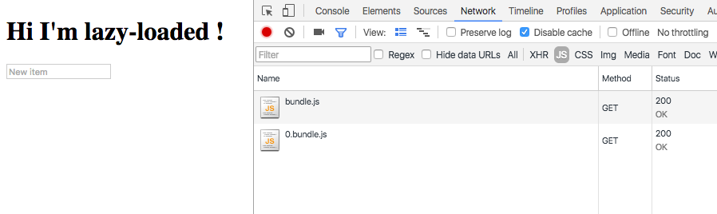

# lazy-routes-choo-example

A choo 🚂🚋🚋 project tweaked to handle lazy routes (code splitted routes) with webpack


## Install

```sh
> yarn
```


## Usage

```sh
> npm start
```

Then go on `http://localhost:8080/lazy` to see a lazy-loaded route!




```js
// Do not forget to wrap the view fn!
const lazyLoadedView = (wrap) => System.import('./dependency.js').then(module => wrap(module.view))

app.router((route) => [
  route('/', view),
  route('/lazy', markAsLazy(lazyLoadedView)) //<-- Here is a lazy route
])

// The promise API is a necessary tradeoff ...
app.start()
.then(domTree => document.querySelector("#choo").appendChild(domTree))
```


## How does it work ?

I've tweaked the wayfarer, and choo libraries to handle lazy routes.

I've uploaded their local forks in the `forked-lib` folder and webpack aliases each lib to the content of this folder.


Have a look at [that issue](https://github.com/yoshuawuyts/sheet-router/issues/62) for more details. 😉
